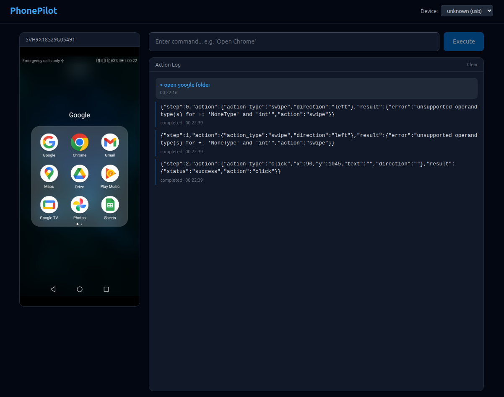

<div align="center">


# PhonePilot

**Local AI agent for Android automation via voice and text**

*Control your phone with natural language. No clouds, full privacy.*

[](LICENSE)
[](https://python.org)
[](https://react.dev)

</div>

---

## Demo



---

## What is PhonePilot?

PhonePilot is a fully local AI agent that understands your Android screen through Vision-Language Models and executes actions via ADB. Give it a command in text or voice — it sees the screen, plans the steps, and taps/swipes/types for you.

```
"Open Telegram and send mom that I'll be home in an hour"
```

The agent captures a screenshot, analyzes it with a VLM (Qwen2.5-VL via Ollama), determines what to tap, executes the action, verifies the result, and repeats until the task is done.

### Key Features

- **Vision-Language AI** — Understands screen content through Qwen2.5-VL, LLaVA, or any Ollama-compatible model
- **Live Screen** — Real-time WebSocket stream of your device screen in the browser
- **Action Log** — See every step the agent takes, with reasoning and results
- **Multi-Device** — Control multiple Android devices simultaneously via USB or WiFi
- **Fully Local** — Everything runs on your machine. Zero cloud dependencies

---

## Quick Start

### Prerequisites

- Docker & Docker Compose
- [Ollama](https://ollama.ai/) with a VLM model
- Android device with USB debugging enabled
- ADB installed (`adb devices` shows your device)

### Setup

```bash
git clone https://github.com/gotogrub/PhonePilot.git
cd PhonePilot

# 1. Install & start Ollama on the host
curl -fsSL https://ollama.ai/install.sh | sh
ollama pull qwen2.5vl:7b

# 2. Start ADB server
adb start-server

# 3. Start services
docker compose up -d

# 4. Open the UI
open http://localhost:3000
```

---

## Architecture

```
┌──────────────────────────────────────────────────┐
│  Clients: Web UI / CLI / REST API / Voice        │
└──────────────────────┬───────────────────────────┘
                       │
              ┌────────▼────────┐
              │  FastAPI Gateway │
              │  /tasks /devices │
              │  /stream /voice  │
              └────────┬────────┘
                       │
          ┌────────────┼────────────┐
          │            │            │
    ┌─────▼─────┐ ┌───▼────┐ ┌────▼──────┐
    │ Task Queue │ │  VLM   │ │  Device   │
    │  (Redis)   │ │(Ollama)│ │  Manager  │
    └───────────┘ └────────┘ └───────────┘
          │            │            │
          └────────────┼────────────┘
                       │
              ┌────────▼────────┐
              │   Agent Core    │
              │ Screenshot →    │
              │ VLM Analysis →  │
              │ Action Plan →   │
              │ Execute → Verify│
              └────────┬────────┘
                       │
              ┌────────▼────────┐
              │ Android Device  │
              │  (ADB / scrcpy) │
              └─────────────────┘
```

### How it works

1. User sends a command (text or voice)
2. Agent captures a screenshot from the device via ADB
3. Screenshot is resized and sent to VLM (Qwen2.5-VL) with the Qwen `mobile_use` tool-calling format
4. VLM returns the next action (tap, swipe, type, etc.) with normalized 0-999 coordinates
5. Agent converts coordinates to real screen pixels and executes via ADB
6. Repeat until the task is complete or max steps reached

---

## Project Structure

```
phonepilot/
├── backend/
│   ├── app/
│   │   ├── api/routes/      # FastAPI endpoints
│   │   ├── core/            # Agent, Planner, Executor
│   │   ├── device/          # ADB wrapper, scrcpy, device manager
│   │   ├── vlm/             # Ollama client, prompts, response parser
│   │   ├── voice/           # STT, TTS, wake word
│   │   ├── memory/          # SQLAlchemy models, action history
│   │   ├── scenarios/       # Record, playback, scheduling
│   │   └── workers/         # Background task execution
│   └── tests/
├── frontend/
│   └── src/
│       ├── components/      # React UI components
│       ├── hooks/           # WebSocket, device hooks
│       ├── stores/          # Zustand state management
│       └── api/             # API client
├── assets/                  # Logo, screenshots, demo videos
├── docs/                    # Documentation
└── docker-compose.yml
```

---

## API

Base URL: `http://localhost:8000`

| Method | Endpoint | Description |
|--------|----------|-------------|
| POST | `/tasks` | Execute a command |
| GET | `/devices` | List connected devices |
| WS | `/stream/{device_id}` | Live screen stream |
| GET | `/scenarios` | List scenarios |
| POST | `/scenarios` | Create scenario |
| POST | `/voice/command` | Voice command (audio upload) |
| GET | `/models` | List available VLM models |
| POST | `/models/switch` | Switch active model |

Full API docs at `http://localhost:8000/docs` (Swagger UI).

---

## Hardware Requirements

| | Minimum | Recommended |
|---|---------|-------------|
| GPU | 8GB VRAM (RTX 3070) | 16GB VRAM (RTX 4070 Ti / 5060 Ti) |
| RAM | 16GB | 32GB |
| CPU | 4 cores | 8 cores |
| Storage | 20GB | 50GB SSD |

### Model VRAM Usage

| Model | VRAM | Quality |
|-------|------|---------|
| Qwen2.5-VL-3B | ~6GB | Good |
| Qwen2.5-VL-7B | ~14GB | Great |
| LLaVA 1.6 7B | ~14GB | Good |

---

## TODO

### Agent Intelligence
- [ ] Proper task queue with status tracking (pending/running/done/failed)
- [x] Task cancellation — stop a running task from the UI
- [x] Retry logic with error analysis — re-prompt VLM on action failure
- [x] Completion verification — take a final screenshot and confirm task is done
- [x] Multi-step planning — agent executes up to 10 steps per task
- [x] Action history passed as context to VLM for better decisions

### UI / UX
- [ ] Settings panel — configure model, max steps, action delay from the UI
- [x] Task cancel button in the frontend
- [x] Better action log formatting — show reasoning, not raw JSON
- [x] Loading/progress indicator during task execution
- [ ] Device screen touch interaction — tap on the live stream to send taps
- [ ] Dark/light theme toggle

### Memory & Learning
- [ ] SQLite database for action history
- [ ] Agent remembers previous actions and app layouts
- [ ] Semantic search over past actions
- [ ] Learn from failures — remember what didn't work

### Voice Control
- [ ] Whisper.cpp integration for STT
- [ ] Piper TTS for voice feedback
- [ ] Wake word detection ("Hey Pilot")
- [ ] Hands-free continuous listening mode

### Automation
- [ ] Scenario recorder — record and replay action sequences
- [ ] Scenario editor in the UI
- [ ] Cron-like scheduler for recurring tasks
- [ ] Conditional logic (if screen contains X, do Y)
- [ ] Import/export scenarios as YAML

### Infrastructure
- [ ] CLI tool (`phonepilot "open Chrome"`)
- [ ] WiFi ADB support (wireless device connection)
- [ ] scrcpy integration for lower-latency streaming
- [ ] Multi-model support — switch between models from the UI
- [ ] Benchmark suite for accuracy testing
- [ ] Test coverage >70%

---

## Documentation

- [Setup Guide](docs/SETUP.md)
- [API Reference](docs/API.md)
- [Models Guide](docs/MODELS.md)
- [Scenarios Guide](docs/SCENARIOS.md)

---

## Contributing

See [CONTRIBUTING.md](CONTRIBUTING.md) for guidelines.

---

## License

[Apache License 2.0](LICENSE)
